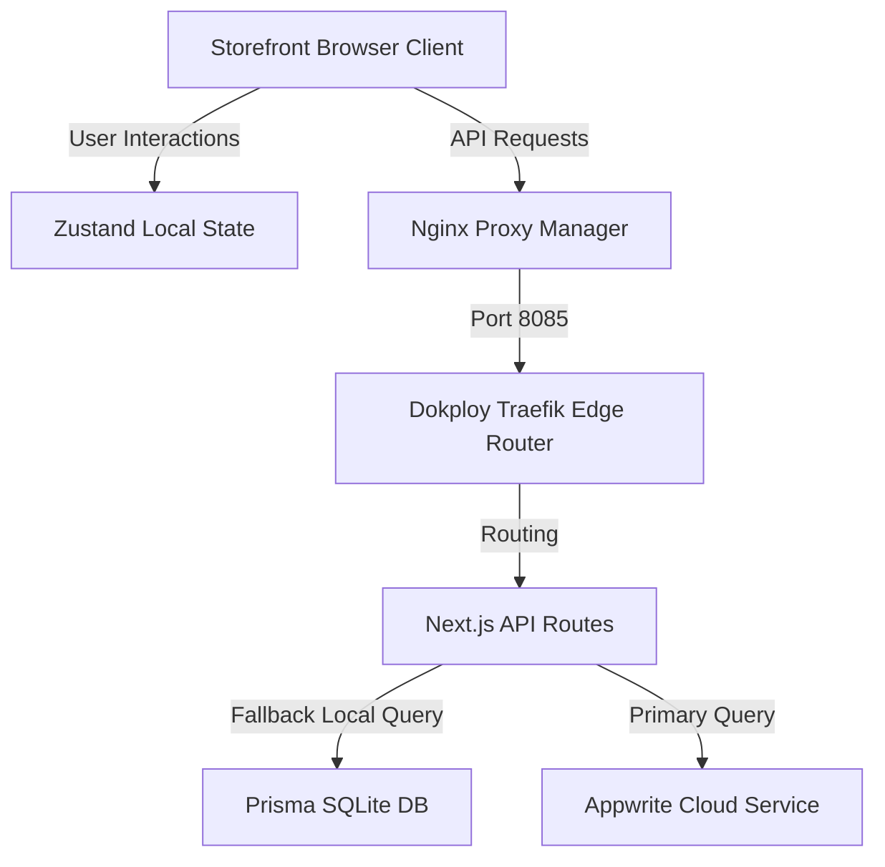

# Architecture — Dr. Huxon Labs

## Tech Stack
- **Framework:** Next.js 16 (App Router)
- **Language:** TypeScript 5
- **Styling:** Tailwind CSS 4 + shadcn/ui
- **State Management:** Zustand (client-side)
- **Database ORM:** Prisma (SQLite database)
- **Backend Services:** Appwrite Cloud (with graceful local fallback)
- **Infrastructure:** Dokploy (Docker Swarm orchestration) on Ubuntu server
- **Edge Proxy:** Nginx Proxy Manager + Let's Encrypt SSL

---

## File Structure Map
- `src/app/` — Routing and layouts:
  - `globals.css` — Core theme variables, custom scrollbars, animations, and typography tokens.
  - `page.tsx` — Main application orchestrator for the storefront views.
  - `admin/` — Admin dashboard and management sections.
  - `api/` — API handlers for orders, products, health, coupons, and reviews.
- `src/components/` — UI Components:
  - `views/` — Storefront views (Shop, Cart, Profile, etc.) lazy loaded.
  - `sections/` — Homepage visual modules (Hero, Timeline, Quiz, etc.).
  - `icons.tsx` — Premium custom-crafted SVG icon set.
  - `huxon-button.tsx` — Custom spring-magnetic button primitive.
  - `smart-image.tsx` — Optimized next/image helper with fallbacks.
  - `skeletons.tsx` — Theme-aware loading placeholders.
- `src/lib/` — Shared utilities and data models:
  - `catalog.ts` — Products, ingredients, FAQs, and static data.
  - `store.ts` — Zustand store implementations (Cart, Wishlist, settings).
  - `db.ts` — Prisma client instance.

---

## Data Flow

